# Architecture

**Status:** Draft — to be discussed at follow-up meeting.

## Design Principles

1. **Generic first** — components should work without KernelCI
2. **Composable** — building blocks that can be assembled differently
3. **Pluggable backends** — swap build/test/storage backends
4. **Reproducible** — deterministic builds and tests across bisection steps
5. **Reuse over reinvention** — wrap existing open-source tools behind component interfaces rather
   than reimplementing them. Define the interface first so tool choice stays swappable; contribute
   upstream over forking.

## Bisect Workflow Entry

The bisection system starts at campaign admission. BCO accepts a Campaign Request from a registered
trigger, rejects requests that cannot run, and uses the equivalence key to avoid duplicate
campaigns.

## Components

The system decomposes into the components below, grouped by area. This section is a high-level map;
the detailed component catalog lives in [components](components.md).

### Core

- Bisection Campaign Orchestrator, BCO - owns campaign admission, lifecycle, routing, retry policy,
  and outcome promotion.

- Build-Test Orchestrator, BTO - executes build/test work for candidates selected by BCO. Runs as
  a separate service/process with its own lifecycle and plan-execution internals. Runtime
  execution composition and sub-component interactions are internal to BTO.

- Commit selector — chooses the next commit(s) to test according to the campaign search policy.

### BCO Internals

- Campaign admission — authenticates triggers, validates Campaign Requests, checks deployment
  capability, and creates or joins campaigns.

- Campaign executor — coordinates commit selection, BTO work, evidence routing, decision
  recording, retry policy, recovery, and outcome promotion.

### BTO Internals

- BT Planner — creates backend-executable build/test intents from build-test plan requests.

- Build runner - builder role that attempts to produce a kernel build for a given build
  identity.

- Test runner — tester role that runs a test against a built kernel.

- Build cache — optional capability for reusing previously produced build artifacts.

- Artifact store — optional storage for build artifacts handed off between separate builder and
  tester instances.

### Analysis And Decision

- Results Analyzer — converts terminal plan output into evidence consumed by the Decision engine.

- Decision engine — applies the configured decision strategy to map a step's evidence to a step
  decision.

### Verification

- Verifier — applies the campaign verification policy to a candidate single-culprit outcome.

### Reporting

- Report generator — produces a bisection report from campaign records and final outcome.

- Recipient finder — derives the recipient list from the culprit commit.

- Report sender — sends a report to its recipients through a configured channel.

### State

- Trigger registry — stores registered trigger identities, admission credentials, and per-trigger
  execution settings used by BCO admission.

- BCO State store — stores BCO-owned campaign, step, attempt, evidence, decision, lease, trigger,
  and outcome records.

- BTO State store — stores BTO-owned plan execution state.

## Workflows

### Normal campaign path is

1. A trigger submits a Campaign Request to BCO.
2. BCO authenticates the trigger through the Trigger registry, validates the request, and records
   campaign state in the BCO State store.
3. BCO asks the Commit selector for the next candidate commit.
4. BCO submits build/test work to BTO for the selected candidate.
5. Inside BTO, the selected composition maps planner, builder, and tester roles to runtime
   instances. BTO chooses the call pattern from those instances and their capabilities.
6. When builder and tester roles use separate instances, BTO uses the Artifact store only if an
   artifact handoff is needed. Build cache, when enabled, sits behind BTO and is not called by BCO.
7. BTO notifies BCO when the work reaches a terminal state. BCO reads the terminal result from BTO.
8. BCO sends terminal plan output to the Results Analyzer.
9. BCO sends normalized evidence to the Decision engine and records the returned step decision.
10. BCO repeats commit selection and build/test execution until the campaign reaches a final
    outcome or cannot continue.

### Optional paths

- Verifier runs only when BCO has a candidate single-culprit outcome and the campaign requested
  verification.
- Reporting components consume BCO campaign output or final outcome; they do not drive bisection
  execution.

## Open Questions

List of open questions is tracked in [open questions](../oq.md).
