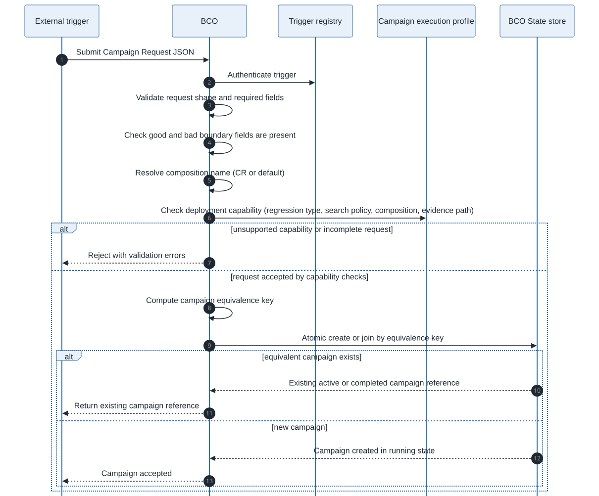
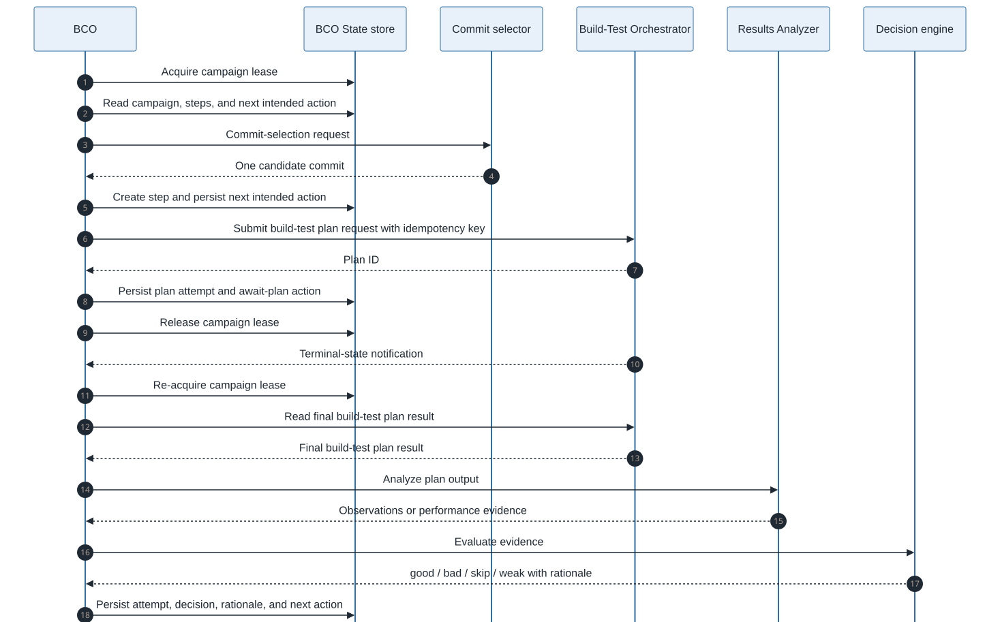
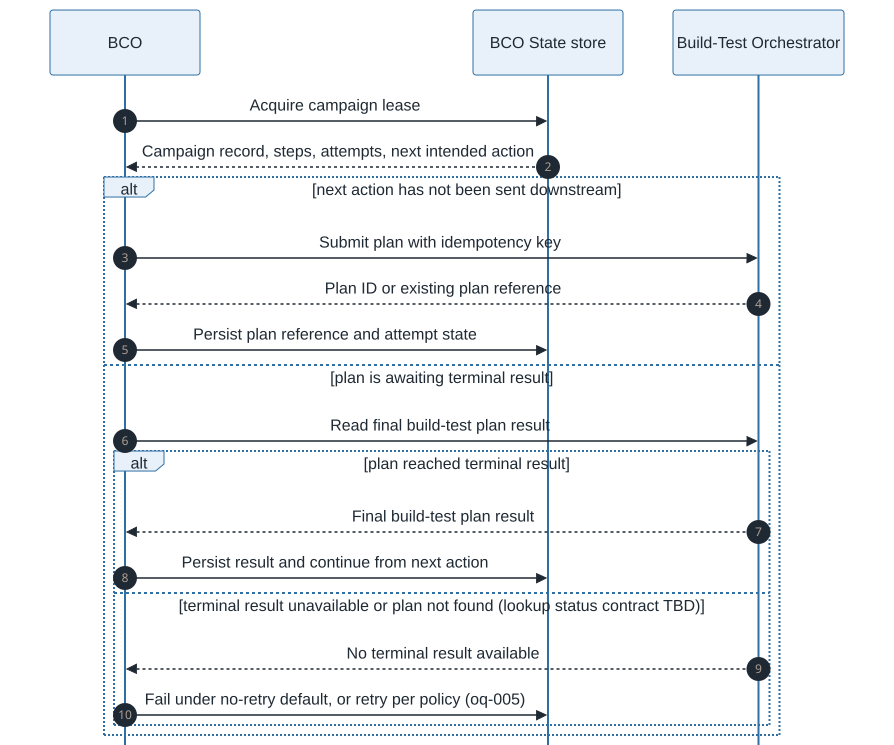

# Bisection Campaign Orchestrator (BCO) Design

**Status:** DRAFT
**Version:** 1

BCO owns campaign admission, lifecycle, work routing, retry policy application, duplicate
prevention, recovery, and outcome promotion. It coordinates other components; it does not implement
their domain logic and it does not call build or test execution services directly.

## Boundaries

BCO does not:

- detect regressions,
- choose initial good/bad boundaries,
- resolve Git history or select commits,
- execute build or test jobs,
- parse raw build/test output,
- decide whether a tested commit is `good` or `bad`,
- perform verification itself.

Those responsibilities belong to the other components of the system.

## Inputs

Primary input is a [campaign request](../contracts/campaign-request.md).

During execution BCO also consumes:

- commit-selection results from the Commit selector
- plan results from the BTO, such as build artifact refs, test result refs, raw output refs,
  plan outcome category
- evidence from the Results Analyzer
- step decisions from the Decision engine
- verification result, if requested, from the Verifier
- persisted campaign and step records from the BCO State store

For default `bisect`, Commit selector requests and results use
[`commit selection request`](../contracts/commit-selection-request.md) and
[`commit selection result`](../contracts/commit-selection-result.md).

Build-test plan requests and results use
[`build-test plan request`](../contracts/build-test-plan-request.md) and
[`build-test plan result`](../contracts/build-test-plan-result.md).

BCO calls BTO using deployment-configured authorization.
TBD: details/approach.

Results Analyzer observations use [`observation contract`](../contracts/observation-contract.md).
Generic performance evaluation uses [`performance evidence`](../contracts/performance-evidence.md).
Decision engine requests and results use [`decision contract`](../contracts/decision-contract.md).

## Outputs

BCO exposes campaign state and campaign outcomes through the [`BCO output`](../contracts/bco-output.md)
read-model contract.

This output is derived from BCO State store records and downstream record references. It
is enough for operators, automation, and validation harnesses to inspect which commits were
tested, which decisions were made, and what final outcome was reached.

## Admission

Admission validates whether the request is complete enough to start a campaign and whether the
deployment can execute it.

BCO admission:

- authenticates the trigger through the Trigger registry,
- validates the campaign request contract,
- resolves the composition name — the one named in the CR, or the trigger/deployment default,
- verifies that the request can run in the deployment:
  - supported regression type
  - search policy
  - the resolved composition is allowed by the deployment
  - the trigger is permitted to use that composition
  - evidence path
- computes the campaign equivalence key
- creates or joins the campaign through the BCO State store.

Detailed request validation, rejection, and equivalence-key fields are defined in
[campaign request](../contracts/campaign-request.md). Deployment capability checks are defined in
[campaign execution profile](../contracts/campaign-execution-profile.md).

BCO does not resolve boundary commits against Git history. Boundary resolution is part of Commit
selector input handling because it depends on the selected source tree and history view.

## Duplicate Prevention

BCO uses the equivalence key defined by the campaign request contract to avoid duplicate
campaigns. Admission either creates a new campaign or attaches the trigger to an existing
equivalent campaign. The State store provides the atomicity required for this operation.

## Generic Workflow Routing

For each selected candidate, BCO submits one build-test plan request and reads one final build-test
plan result. BCO uses the plan result `outcome` category to route: `content_result` goes to the
Results Analyzer, whose normalized evidence BCO then sends to the Decision engine;
`infrastructure_failure` and `invalid_request` fail the campaign under the current default (no
automatic retry). BCO does not author step decisions; the Decision engine does, and a `skip` comes from its
qualification gate or from strategy-level unusable evidence. Retry and the `exhausted` step status
are future/policy-enabled (oq-005), not the current default.

### Results Analyzer And Decision Failures

A failed Results Analyzer or Decision engine attempt is not a step decision. Under the current
default (no automatic retry) such a failure fails the campaign. Retrying these failures is
future/policy-enabled (oq-005).

## Single-Candidate Rounds

Standard `bisect` always returns one candidate per selection round. BCO submits one build-test plan
for that candidate, sends the plan result to the Results Analyzer along the configured evidence
path, sends the resulting evidence to the Decision engine, records the step decision, and sends the
updated decision history back to the Commit selector for the next round.

For each round, BCO provides the Commit selector with the current boundaries and known terminal
step outcomes. The selector returns the next candidate or a terminal selection result. BCO does
not expect the selector to execute builds/tests or remember campaign lifecycle state.

TBD: Multi-candidate rounds are required by `n_bisect` and `multi_level_bisect`. Those policies are
tracked under oq-002, oq-011, oq-023.

## Retry Policy

The current default is no automatic retry: a failure that cannot produce a step decision fails the
campaign. BCO owns campaign retry policy and may later submit another build-test plan request when a
configured retry policy allows another attempt (future/policy-enabled, oq-005); neither BTO nor the
Decision engine retries in order to produce a different step decision.

BCO records repeated attempts under the same bisection step and exposes the final step state
through the State store and BCO output contracts.

## Convergence

BCO continues the campaign while the Commit selector can produce candidates and campaign policy
allows more work. The campaign stops when the selector returns a terminal result, required
evidence cannot be produced, or campaign policy prevents further progress.

BCO turns terminal selector state and recorded step decisions into a campaign outcome or campaign
failure. Commit-selection result details are defined by the Commit selector contract.

BCO maps the terminal selector result to an outcome:

- `converged` -> `single_culprit`, culprit = `selector_state.bad_boundary`;
- `blocked` -> `narrowed_range` when good and bad boundaries are reportable, else `unresolved`;
- `invalid_request` -> campaign failure, BCO admitted a state the selector cannot evaluate.

If no step decides `bad` — every tested candidate is `good`, `skip`, or `weak` — the suspected
regression did not reproduce under the fixed scope, and BCO records `not_confirmed` rather than
asserting a culprit.

When the campaign requires verification, BCO records `verifying` before promoting a `single_culprit`
and finalizes the outcome from the Verifier result.

## Recovery

BCO uses campaign leases and persisted next action to resume without re-deciding completed work.
State store consistency requirements are defined in [State store design](state-store.md).

## Outcome

BCO owns the outcome before it writes the terminal campaign state. It promotes the campaign by
recording either a final outcome or a failure reason in the State store. BCO output exposes that
recorded state as a read model for consumers.

## Verification

Verification is an optional post-search step. BCO invokes the Verifier only when the campaign
result and campaign policy require verification, then maps the verification result into the final
campaign outcome.
