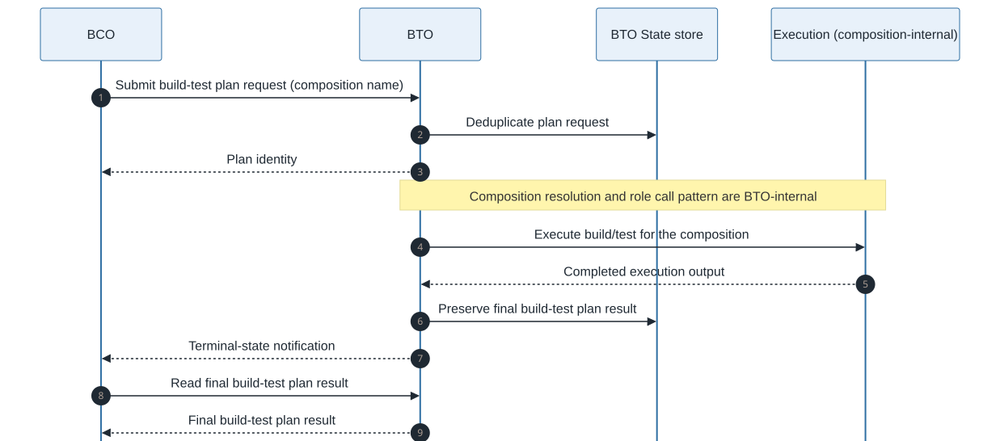

# Build-Test Orchestrator (BTO) Design

**Status:** DRAFT
**Version:** 1

BTO executes build/test work on behalf of BCO. It owns build-test plan execution, BTO state,
runtime execution composition, backend-specific plan creation, and final build-test plan results.

## Role

BTO sits between BCO and the build/test systems available in the deployment. For one selected
candidate, it accepts a build-test plan request, resolves the selected composition, prepares the
execution work, schedules execution, and returns one final build-test plan result to BCO.

## Boundaries

BTO does not:

- select commits,
- decide bisection step outcomes,
- interpret evidence for regression decisions,
- own campaign retry policy,
- maintain BCO campaign state.

## Inputs

Primary input is a [build-test plan request](../contracts/build-test-plan-request.md) from BCO.

The request describes the candidate source, the execution scope, the selected composition, and
requested outputs. BTO may translate it internally before execution.

## Outputs

BTO exposes:

- a plan identity for accepted BTO work,
- a terminal-state notification to BCO when the work finishes,
- a [build-test plan result](../contracts/build-test-plan-result.md).

## State store

BTO owns a state store separate from the BCO state store. BTO uses it to collapse repeated
submissions of the same plan to one plan identity, preserve plan progress, and serve final
build-test plan results without exposing its storage to BCO. Idempotent submission does not reuse
test results across attempts.

BCO references BTO work by plan identity and never reads BTO storage directly.

## Execution Composition

BTO hides execution composition from BCO. A runtime composition maps BTO's internal roles to
configured instances. Composition shape is defined in
[execution composition](../contracts/execution-composition.md) and ADR-0008.

- planner
- builder
- tester

The roles are logical. One instance may implement one, two, or all three roles, or a deployment
may configure separate instances. BTO resolves the selected composition internally before
executing a plan, preserving the dependency between produced build content and test execution.

When execution composition requires artifact handoff, BTO uses the Artifact store. When build reuse
is enabled, BTO may use the Build cache. Both remain behind BTO from BCO's perspective.

## Contract Surface

BTO exposes only the interactions BCO needs to hand off build/test work and later retrieve the
result. Transport and authorization are deployment-defined and do not change the contract shape.

### Submit Plan

BCO submits a build-test plan request for one selected candidate attempt. If BTO accepts the
request, it returns a plan identity that BCO can store with the campaign step and use for later
result lookup.

### Terminal Result Lookup

BCO reads the final build-test plan result for a known plan. The result is the BCO-facing summary
of BTO-owned execution, which BCO carries into the Results Analyzer request.

### Terminal-State Notification

BTO notifies BCO when a plan reaches a terminal state. The notification is not the result payload;
it tells BCO that the final build-test plan result is ready to read.
