# Decision Engine Design

**Status:** DRAFT
**Version:** 1

The Decision engine applies a decision strategy to normalized evidence and returns one step
decision to BCO. Current approach defines two stages of decision-making:

- a universal qualification gate that maps a candidate with no usable result to `skip`
- a set of rules that maps a qualified result to `good`, `bad`, or `weak` (or `skip` when the
  evidence cannot be used).

## Role

The Decision engine keeps step-decision logic separate from evidence extraction and campaign
orchestration. It consumes evidence prepared by the Results Analyzer and maps that evidence to the
common step decision model used by BCO and the Commit selector.

## Boundaries

The Decision engine does not:

- parse raw build/test output
- run build or test work
- select commits
- schedule retries or repetitions
- promote campaign outcomes
- store campaign lifecycle state

## Inputs

Primary input is a [decision request](../contracts/decision-contract.md) from BCO.

The request carries normalized evidence from the Results Analyzer, the admitted decision strategy,
the expected signal, campaign scope, and step context.

## Outputs

The Decision engine returns a [decision result](../contracts/decision-contract.md) to BCO.

The result contains one step decision and rationale that BCO can record with the step. Exact
decision values and rationale shape are defined by the decision contract.

## Strategies

The stage 2 rule set is chosen by the campaign execution profile from the regression type; it is
not carried in the campaign request.

Each strategy maps its supported evidence shape onto the common step decision model. `binary` and
`performance` are the stage 2 evaluators, and both run behind the same universal qualification gate.
A `parse_error` set has no qualification observation; the strategy maps it directly to `skip`,
outside the gate.

Strategy details are defined in
[binary decision strategy](../contracts/binary-decision-strategy.md) and
[performance decision strategy](../contracts/performance-decision-strategy.md).
