# BCO State Store Design

**Status:** DRAFT
**Version:** 1

The BCO state store is the durable coordination boundary for BCO-owned campaign execution. It
stores campaign progress, lifecycle state, step state, evidence and decision references, trigger
membership, leases, and final campaign records.

## Role

The BCO state store gives BCO a consistent place to admit campaigns, coordinate one active writer,
resume interrupted work, and expose auditable campaign state.

## Boundaries

The state store does not:

- validate campaign requests
- compute campaign equivalence keys
- select commits
- execute build or test work
- analyze evidence
- decide step outcomes
- promote campaign outcomes

## Stored State

The state store owns durable records for:

- admitted campaigns and their lifecycle state
- selected steps and their lifecycle state
- per-step attempt records, including the `attempt_number`/`attempt_id` mapping (see
  [bisection data model](../bisection-data-model.md))
- normalized evidence references
- decision records and final step state
- final outcome or failure records
- campaign leases and persisted next intended action
- registered triggers and campaign-trigger membership

Large logs, artifacts, measurements, and backend-native records may live outside the state
store. The state store keeps durable references needed for resume, audit, and BCO output.

## Campaign Lifecycle

Campaign status values are:

- `accepted`: admitted durably, but campaign execution has not started;
- `running`: admitted and being bisected;
- `completed`: campaign reached a normal final outcome;
- `failed`: campaign cannot continue because of an unrecoverable orchestration, configuration, or
  execution-contract problem.

When the campaign requests verification, the optional Verifier adds a `verifying` status while
post-search verification runs.

`completed` and `failed` are terminal and are not moved back to an active state.

## Step Lifecycle

Step status values are:

- `pending`: candidate step is recorded but no downstream work has started
- `running`: at least one attempt is in progress or being processed
- `decided`: the step has a final step decision
- `exhausted`: campaign policy exhausted the step without a final decision (future/policy-enabled,
  oq-005; not reached under the current no-retry default)

`decided` and `exhausted` are terminal for that step.

## Admission And Trigger State

The state store provides atomic create-or-join behavior for equivalent campaign requests. If an
equivalent campaign already exists, BCO attaches the trigger to the existing campaign rather than
creating duplicate campaign execution.

The trigger registry stores registered trigger identities, admission credentials, and per-trigger
execution settings used by BCO admission.

## Coordination

BCO uses campaign leases to ensure that only one actor mutates a running campaign at a time.
Mutations that advance campaign execution require the current lease holder.

BCO records the next intended action before calling downstream components. This lets BCO resume
after interruption without re-deciding already completed work.

## Outcome And Output

When a campaign reaches terminal state, BCO records either the final campaign outcome or the
failure reason in the state store.

BCO output exposes the recorded campaign state as a read model for consumers. The model is
defined in [BCO output](../contracts/bco-output.md).

## Consistency Requirements

The state store must provide:

- atomic create-or-join by campaign equivalence key
- conditional lifecycle transitions
- single-writer campaign mutation through leases
- durable persistence of completed downstream results before BCO advances workflow state
- immutable terminal campaign and step state, except for append-only audit metadata
